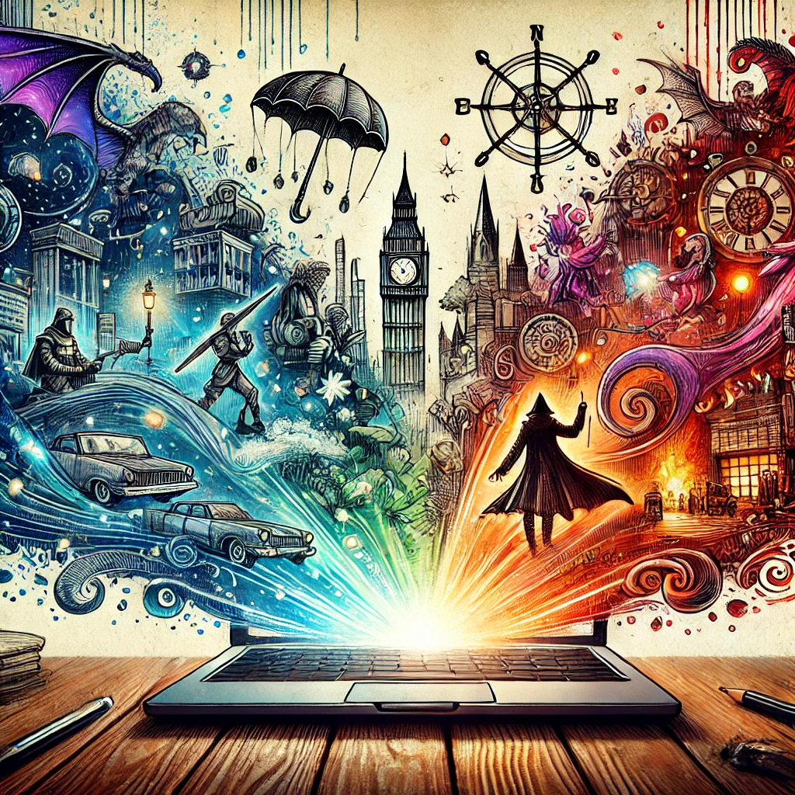

# MAGnet : la moulinette à GN 

<!--    
-->
    
    

		

		<h2>A quoi sert MAGnet ?</h2>
        

            MAGnet est un outil d’assistance à l’écriture de GNs. Il vise à automatiser et traquer des tâches répétitives et sources d’erreurs lors des phases d’écriture, ainsi qu’à donner une vue d’ensemble du jeu et de son état à tout moment.
        

        

            MAGnet a deux objectifs :
        

        <ul>
            <li><strong>Faciliter l’écriture du jeu</strong></li>
            <li><strong>Faciliter la coordination entre les auteurs dans le cas d’une équipe</strong></li>
        </ul>
    

	
	

    <h2>Que permet MAGnet ?</h2>
    <ul>
        <li><strong>Aide à l’écriture :</strong>
            <ul>
                <li>Cohérence des scènes entre les back des différents personnages impliqués</li>
                <li>Fourniture en phase de pré-écriture des fiches d’un canevas – le squelette – regroupant toutes les informations essentielles</li>
                <li>Cohérence de la chronologie par intrigue, personnage ou jeu</li>
                <li>Rassemblement des informations disséminées pour nourrir les aides de jeu</li>
                <li>Visualisation des évènements pour coordination en amont et durant le jeu</li>
                <li>Facilitation des briefs PNJs et de l’organisation logistique le jour J</li>
                <li>Tracking des objets de jeu pour, suivi de ceux à fabriquer si nécessaire et effets spéciaux associés</li>
				<li>Insertion automatique des photos des personnages connus par un PJ dans sa fiche, ou création de tombinoscopes dédiés par personnage</li>
				<li>Calcul du nombre de personnages nécessaires pour dispoer de tous les PNJs et jeu, et de la réapartition des rôles entre ceux qui les joueront</li> 
            </ul>
        </li>
        <li><strong>Aide à la coordination :</strong>
            <ul>
                <li>Suivi des tâches (todo) sur chaque intrigue/personnage</li>
                <li>Suivi des commentaires ouverts et discussions entre organisateurs</li>
                <li>Visualisation des dernières modifications sur le jeu (scènes, personnages affectés, organisateurs responsables)</li>
            </ul>
        </li>
    </ul>

<!--
MAGnet est un outil d’assistance à l’écriture de GNs. Il vise à automatiser et traquer des tâches répétitives et sources d’erreurs lors des phases d’écriture, ainsi qu’à donner une vue d’ensemble du jeu et de son état à tout moment.

MAGnet a deux objectifs :

- **Faciliter l’écriture du jeu**
- **Faciliter la coordination entre les auteurs dans le cas d’une équipe**

<h2>MAGnet permet notamment :</h2>

    
    

<!--        <h2>MAGnet permet notamment :</h2>
        <ul>
            <li><strong>Aide à l’écriture :</strong>
                <ul>
                    <li>Cohérence des scènes entre les back des différents personnages impliqués</li>
                    <li>Fourniture en phase de pré-écriture des fiches d’un canevas – le squelette – regroupant toutes les informations essentielles</li>
                    <li>Cohérence de la chronologie par intrigue, personnage ou jeu</li>
                    <li>Rassemblement des informations disséminées pour nourrir les aides de jeu</li>
                    <li>Visualisation des évènements pour coordination en amont et durant le jeu</li>
                    <li>Facilitation des briefs PNJs et de l’organisation logistique le jour J</li>
                    <li>Tracking des objets de jeu, fabrication si nécessaire et effets spéciaux associés</li>
					<li>Insertion automatique des photos des personnages connus par un PJ dans sa fiche, ou création de tombinoscopes dédiés par personnage</li>
					<li>Calcul du nombre de personnages nécessaires pour dispoer de tous les PNJs et jeu, et de la réapartition des rôles entre ceux qui les joueront</li> 
                </ul>
            </li>
            <li><strong>Aide à la coordination :</strong>
                <ul>
                    <li>Suivi des tâches (todo) sur chaque intrigue/personnage</li>
                    <li>Suivi des commentaires ouverts et discussions entre organisateurs</li>
                    <li>Visualisation des dernières modifications sur le jeu (scènes, personnages affectés, organisateurs responsables)</li>
                </ul>
            </li>
        </ul>
    

-->

## 📥 Télécharger l'application
En téléchargeant l’Application, vous reconnaissez avoir lu, compris et accepté l'intégralité des [Conditions d’Utilisation.](/cgu/)

[📄 Lien vers les téléchargements](https://docs.google.com/document/d/1FjW4URMWML_UX1Tw7SiJBaoOV4P7F_rKG9pmnOBjO4Q/edit?usp=sharing)

## 📖 Manuel d'utilisation
[📄 Lien vers le manuel](https://docs.google.com/document/d/1U1D5byuXXv6_dHo13fcn9ka50pYYHzMlNGtH3gfE1Sc/edit?usp=sharing)
